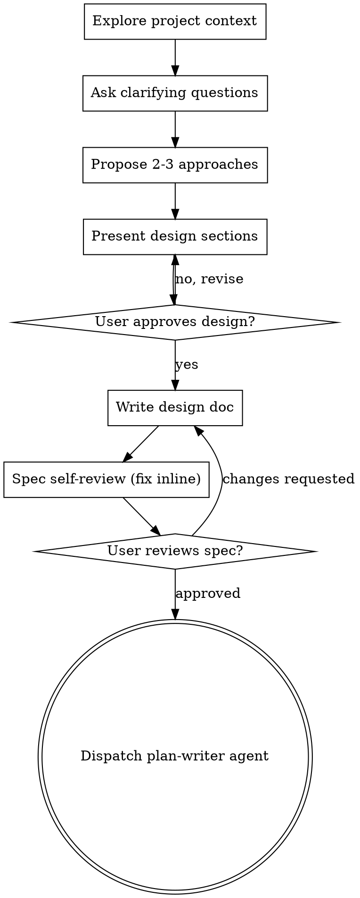

# Brainstorming Ideas Into Designs

Help turn ideas into fully formed designs and specs through natural,
collaborative dialogue.

Start by understanding the current project context, then ask questions one at a
time to refine the idea. Once you understand what you're building, present the
design and get user approval.

<HARD-GATE>
Do NOT write any code, scaffold any project, dispatch any implementation agent,
or take any implementation action until you have presented a design and the user
has approved it. This applies to EVERY project regardless of perceived
simplicity.
</HARD-GATE>

## Anti-Pattern: "This Is Too Simple To Need A Design"

Every project goes through this process — a todo list, a one-function utility, a
config change, all of them. "Simple" projects are where unexamined assumptions
cause the most wasted work. The design can be short (a few sentences for truly
simple projects), but you MUST present it and get approval.

## Checklist

Create a task for each item and complete them in order:

1. **Explore project context** — files, docs, recent commits.
2. **Ask clarifying questions** — one at a time; understand purpose,
   constraints, success criteria.
3. **Propose 2–3 approaches** — with trade-offs and your recommendation.
4. **Present design** — in sections scaled to complexity; get approval after
   each section.
5. **Write the design doc** — save to `docs/specs/YYYY-MM-DD-<topic>-design.md`
   and commit (user preferences for spec location override this default).
6. **Spec self-review** — inline check for placeholders, contradictions,
   ambiguity, scope.
7. **User reviews the written spec** — ask before proceeding.
8. **Transition to planning** — dispatch the `plan-writer` agent to turn the
   approved spec into an implementation plan.

## Process Flow

**The terminal state is dispatching the `plan-writer` agent.** Do NOT jump to any
other implementation work first.

## The Process

**Understanding the idea:**
- Check the current project state first (files, docs, recent commits).
- Before detailed questions, assess scope: if the request describes multiple
  independent subsystems ("a platform with chat, storage, billing, analytics"),
  flag it immediately. Don't refine details of a project that needs decomposing.
- If it's too large for one spec, help decompose into sub-projects: the
  independent pieces, how they relate, and the build order. Then brainstorm the
  first sub-project through the normal flow. Each sub-project gets its own
  spec → plan → implementation cycle.
- For appropriately-scoped projects, ask questions one at a time. Prefer
  multiple-choice when possible; open-ended is fine. One question per message.
  Focus on purpose, constraints, success criteria.

**Exploring approaches:**
- Propose 2–3 approaches with trade-offs. Lead with your recommendation and why.

**Presenting the design:**
- Present once you believe you understand what you're building. Scale each
  section to its complexity (a few sentences if straightforward, up to ~200–300
  words if nuanced). Ask after each section whether it looks right.
- Cover architecture, components, data flow, error handling, testing.

**Design for isolation and clarity:**
- Break the system into smaller units that each have one clear purpose,
  communicate through well-defined interfaces, and can be understood and tested
  independently. For each unit you should be able to say what it does, how you
  use it, and what it depends on.
- Can someone understand a unit without reading its internals? Can you change the
  internals without breaking consumers? If not, the boundaries need work. Smaller,
  well-bounded units are also easier to implement reliably.

**Working in existing codebases:**
- Explore the current structure before proposing changes; follow existing
  patterns. Where existing code has problems that affect the work (a file grown
  too large, tangled responsibilities), include targeted improvements — the way
  a good developer improves code they're working in. Don't propose unrelated
  refactoring.

## After the Design

**Documentation:** write the validated spec to
`docs/specs/YYYY-MM-DD-<topic>-design.md` and commit it (use the `humanizer`
skill on the prose if useful).

**Spec self-review** — with fresh eyes: scan for placeholders (TBD/TODO/vague
requirements) and fix them; check internal consistency; check scope (focused
enough for one plan, or needs decomposition?); check ambiguity (could a
requirement be read two ways? pick one and make it explicit). Fix issues inline.

**User review gate** — after the self-review passes, ask the user to review the
spec file before proceeding:

> "Spec written and committed to `<path>`. Please review it and tell me if you
> want changes before we write the implementation plan."

Wait for their response. If they request changes, make them and re-run the
self-review. Only proceed once they approve.

**Planning:** dispatch the `plan-writer` agent with the approved spec to produce
the implementation plan. Do nothing else first.

## Key Principles

One question at a time · multiple choice preferred · YAGNI ruthlessly · explore
2–3 alternatives before settling · incremental validation (approval before
moving on) · be flexible and go back to clarify when something doesn't make
sense.
