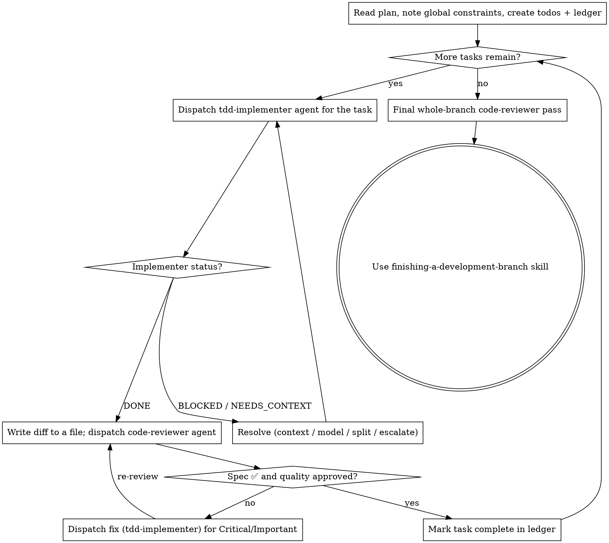

# Subagent-Driven Development

Execute a plan by dispatching a fresh **`tdd-implementer`** agent per task, a
**`code-reviewer`** agent after each (spec compliance + code quality), and one
broad whole-branch `code-reviewer` pass at the end. You are the controller.

**Why subagents:** you delegate tasks to agents with isolated context. By
precisely crafting their instructions you keep them focused and preserve your own
context for coordination. They never inherit your session history — you construct
exactly what each needs.

**Core principle:** fresh implementer per task + per-task review + broad final
review = high quality, fast iteration.

**Continuous execution:** do not pause to check in between tasks. Execute all
tasks without stopping. The only reasons to stop: an unresolvable BLOCKED status,
ambiguity that genuinely prevents progress, or all tasks complete. "Should I
continue?" prompts waste the user's time.

## When to Use

Use when you have an implementation plan, its tasks are mostly independent, and
you're staying in this session. If tasks are tightly coupled, or you want a
separate session, use the `plan-executor` agent instead. No plan yet? Brainstorm
and write one first (`brainstorming` skill → `plan-writer` agent).

## The Loop



## Pre-Flight Plan Review

Before dispatching Task 1, scan the plan once for conflicts: tasks that
contradict each other or the Global Constraints, and anything the plan mandates
that the review rubric treats as a defect (a test asserting nothing, verbatim
duplication). Present everything you find as one batched question — each finding
beside the plan text that mandates it, asking which governs — before execution
begins. If the scan is clean, proceed without comment.

## Model Selection

The agents default to a capable model. Keep that for tasks requiring judgment,
integration, or design, and for every review. For purely mechanical tasks where
the plan already contains the exact code to write (transcription plus testing),
a cheaper/faster tier is fine — but turn count beats token price: the cheapest
models often take 2–3× the turns on multi-step work. Use a mid-tier as the floor
for implementers working from prose.

## Handling Implementer Status

The `tdd-implementer` reports one of four statuses:

- **DONE** — proceed to review.
- **DONE_WITH_CONCERNS** — read the concerns first. Correctness/scope concerns:
  address before review. Observations ("this file is getting large"): note and
  proceed.
- **NEEDS_CONTEXT** — provide the missing information and re-dispatch.
- **BLOCKED** — assess: context problem → add context, re-dispatch; needs more
  reasoning → re-dispatch on a more capable model; too large → split into smaller
  pieces; plan itself is wrong → escalate to the human.

**Never** ignore an escalation or force the same model to retry unchanged.

## Constructing Review Dispatches

Per-task reviews are task-scoped gates; the broad review happens once at the end.
When you dispatch the `code-reviewer` agent:

- Hand it the diff **as a file**, not pasted into your context. Write the review
  package to a uniquely named file and give the reviewer its path:

  ```bash
  { git log --oneline BASE..HEAD; echo; git diff --stat BASE..HEAD; echo; \
    git diff -U10 BASE..HEAD; } > "$CLAUDE_JOB_DIR/tmp/review-task-N.diff"
  ```

  Use the BASE you recorded **before** dispatching the implementer — never
  `HEAD~1`, which silently truncates a multi-commit task.
- Copy the binding Global Constraints (exact values, formats, stated
  relationships like "same layout as X") verbatim into the dispatch as the
  reviewer's attention lens. The reviewer's own instructions already carry the
  process rules.
- Do NOT pre-judge findings — never tell the reviewer what not to flag or
  pre-rate a severity. If you think something is a false positive, let the
  reviewer raise it and adjudicate in the loop. Words like "don't flag," "at most
  Minor," or "the plan chose" in your dispatch mean you're pre-judging — stop.
- A dispatch describes one task, not the session's history. Don't paste prior-task
  summaries; a fresh reviewer needs the task, the interfaces it touches, and the
  constraints. Nothing else.

## Fix and Re-Review Loop

Dispatch a fix (a fresh `tdd-implementer` scoped to the findings) for Critical and
Important findings; record Minor findings in the ledger for the final review to
triage. Every fix carries the implementer contract: it re-runs the tests covering
its change and reports the results — confirm the fix report contains the covering
tests, the command, and the output before re-dispatching the reviewer.

A finding the plan mandated (or that conflicts with plan text) is the human's
decision — present the finding and the plan text, ask which governs. Don't
dispatch a fix that contradicts the plan without asking.

Resolve any ⚠️ "cannot verify from diff" items yourself — you hold the plan and
cross-task context the reviewer lacks. A confirmed gap is a failed spec review:
send it back and re-review.

## Final Whole-Branch Review

After all tasks, write one package for the full branch
(`MERGE_BASE=$(git merge-base main HEAD)` → `git diff` range to a file) and
dispatch a `code-reviewer` pass on the most capable model, pointed at the ledger's
Minor-findings roll-up so it can triage what must be fixed before merge. If it
returns findings, dispatch ONE fix implementer with the complete list — not one
fixer per finding. Then use the `finishing-a-development-branch` skill.

## Durable Progress (Ledger)

Conversation memory does not survive compaction; controllers that lose their
place re-dispatch completed tasks — the most expensive failure. Track progress in
a ledger file, not only todos:

- At start, check for one:
  `cat "$(git rev-parse --show-toplevel)/.sdd-progress.md"` (git-ignored scratch).
  Tasks marked complete there are DONE — resume at the first unmarked task.
- When a task's review comes back clean, append one line:
  `Task N: complete (commits <base7>..<head7>, review clean)`.
- The ledger is your recovery map: the commits it names exist in git even when
  your context no longer remembers creating them. After compaction, trust the
  ledger and `git log` over recollection.

## Red Flags

**Never:** start on `main`/`master` without consent · skip a task review or accept
one missing either verdict (spec compliance AND quality) · proceed with unfixed
Critical/Important issues · dispatch multiple implementers in parallel (they
conflict) · make an implementer read the whole plan (hand it just its task) ·
tell a reviewer what not to flag or pre-rate severity · dispatch a reviewer
without a diff file · re-dispatch a task the ledger already marks complete.

## Integration

Requires: `using-git-worktrees` skill (isolated workspace) · `plan-writer` agent
(produces the plan) · `tdd-implementer` and `code-reviewer` agents (the workers) ·
`finishing-a-development-branch` skill (integration). Alternative: the
`plan-executor` agent for single-session, non-dispatch execution.
